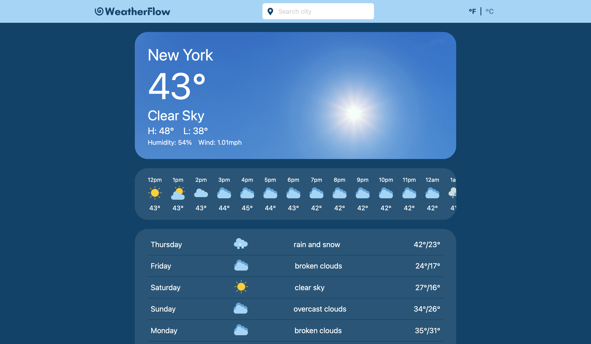

# 🌀WeatherFlow
WeatherFlow is a simple web app to look up weather forecasts by city.

[Live demo](https://kwen0.github.io/weather-app/)



## Features
- Allows user to search any city's weather forecast.
- Displays the city's current weather forecast, hourly forecast, and 7 day forecast.
- Background image is randomized based on the city's current weather condition.
- Can switch between Fahrenheit and Celsius.

## Tools Used
- Plain Javascript, HTML, and CSS
- [Openweather API](https://openweathermap.org/api) for weather forecast data
- [Unsplash API](https://unsplash.com/developers) for background images

## Getting Started
- No dependencies are required to run this app locally, simply clone the repository and open the index.html file in your browser.
```
$ git clone git@github.com:kwen0/weather-app.git
```

## Future Features
- Improve mobile friendliness.
- Refine the search function to a country.
- Allow user to search location by zip code. 

## Notes
- For the purpose of deploying this app to Github Pages, the API keys used have not been hidden.
